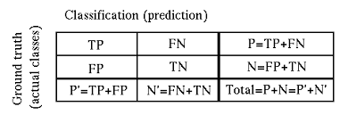
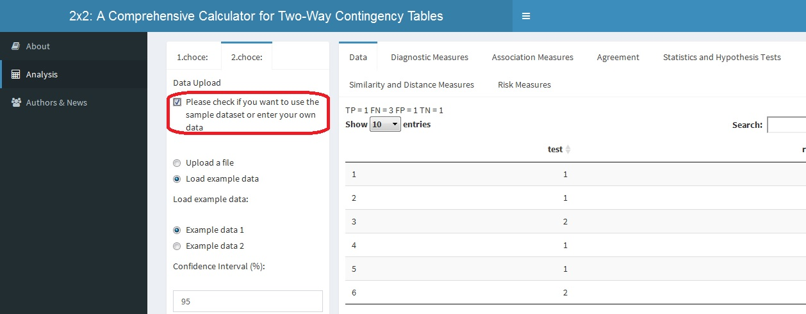
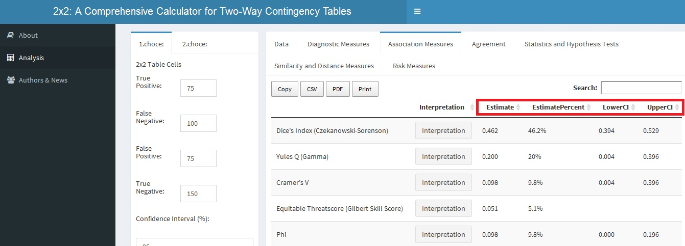
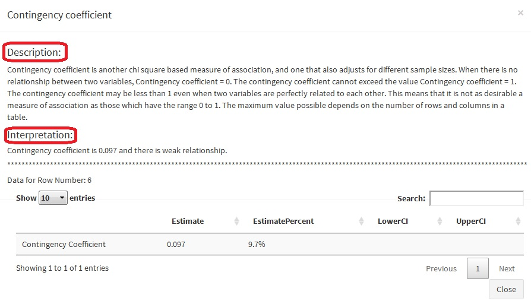
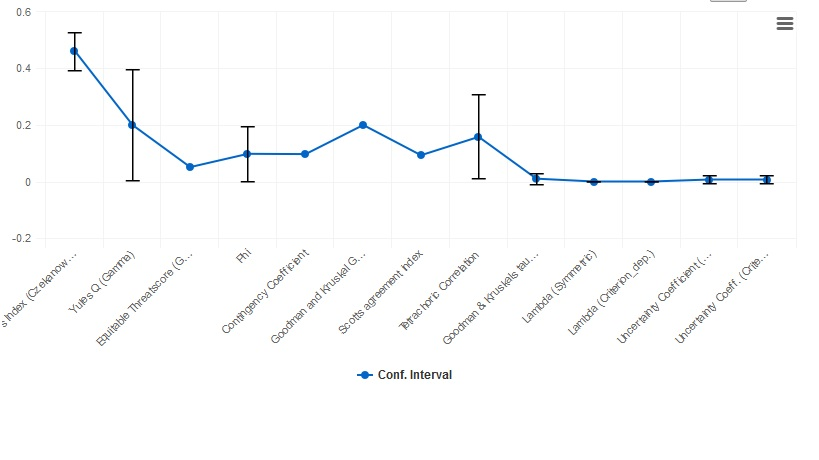
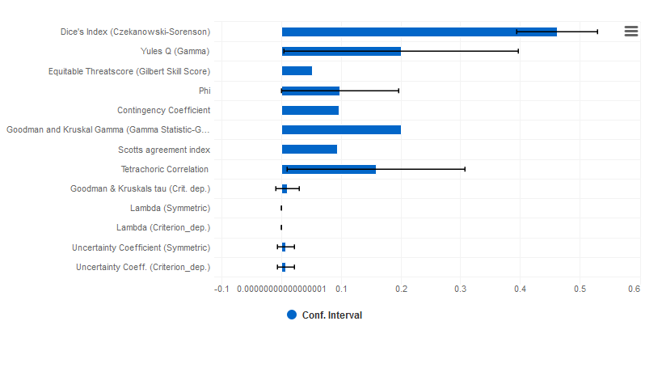
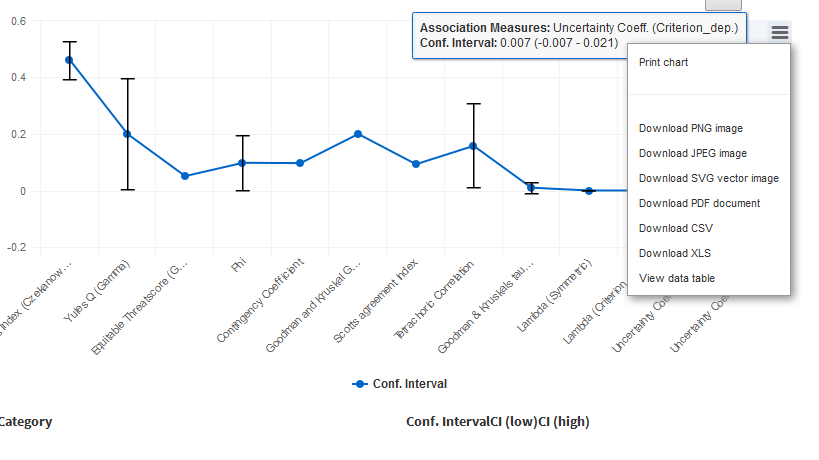
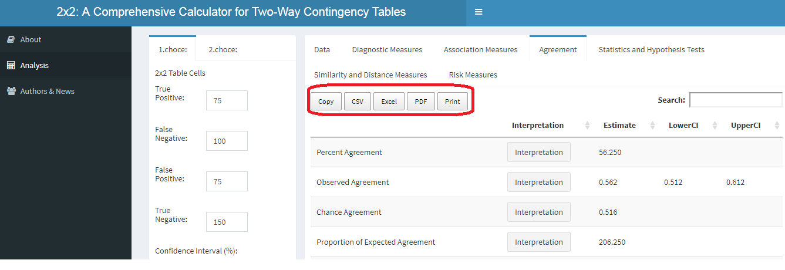

```{r setup, include=FALSE}
knitr::opts_chunk$set(echo = TRUE)
```

## Abstract

Most of the researches in the health field require 2x2 cross tables to perform categorical data analysis. To investigate the performance of diagnostic tests in determining the presence or absence of a disease, to make risk estimates in terms of variables thought to be of interest to the disease, to investigate the cause-and-effect relationship between two clinical categories, to investigate the relationship between two evaluators, to evaluate the performance of classification methods, statistical calculations can be done on these tables for solving many problems such as calculating similarity measures.

Commonly we classify study participants as follows: TP = number of people with both the disease and exposure, FP = number of people with the exposure but not the disease, FN = number of people with the disease but not the exposure, TN = number of people with neither the disease nor the exposure. Layout of a 2x2 table:



This tool includes analysis procedures for 2x2 contingency table. Each procedure includes following features:

Diagnostic Measures:Sensitivity, Sensitivity of a random test, Quality index of sensitivity, Specificity, Specificity of a random test, Quality index of specificity, Efficiency (Correct classification rate), Efficiency of a random test, Quality index, Youden's index, Number Needed to Diagnose, Number Needed to Misdiagnose, Predictive value of positive test, Pred. value of a positive random test, Predictive value of negative test, Pred. value of a negative random test, False positive rate, False negative rate, True positive rate, Misclassification rate, Rand Index, Discriminant Power, F1 Score (F Measure), Entropy for true, Entropy for False, Joint Entropy, Mutual Information, Joint Entropy - Entropy for true, Joint Entropy - Entropy for false, Similarity of Descriptors True and False, Distance Between True and False, Relative Improvement Over Chance (RIOC), Relative Entropy for Negative Test

Association Measures:Dice's Index (Czekanowski-Sorenson), Yules Q (Gamma), Equitable Threatscore (Gilbert Skill Score), Phi, Contingency Coefficient, Goodman and Kruskal Gamma, Scotts agreement index, Tetrachoric Correlation, Goodman & Kruskals tau (Crit. dep.), Lambda (Symmetric), Lambda (Criterion_dep.), Uncertainty Coefficient (Symmetric), Uncertainty Coeff. (Criterion_dep.)

Agreement Measures: Cohen's Kappa, Observed Agreement, Chance Agreement, Positive Agreement, Negative Agreement, Byrt's Bias Index, Byrt's Prevalence Asymmetry Index, Bias Adjusted Kappa, Prevalence & Bias Adjusted Kappa

Statistics and Hypothesis Tests:Pearson Chi-Square Analysis, Pearson Chi-Square Analysis with Yate's correction (Continuity Correction), Likelihood Ratio Chi Square, Minimum Expected Frequency, Cells with Expected Frequency less than 5, Cells with Expected Frequency less than 1, McNemar's Test, McNemar's Test with Yate's correction

Smilarity and Distance Measures:Jaccard (Similarity), Dice (Similarity), Czekanowski (Similarity), 3w Jaccard (Similarity), Nei&Li (Similarity), Sokal&Sneath-1 (Similarity), Sokal&Michener (Similarity), Sokal&Sneath-2 (Similarity), Roger&Tanimoto (Similarity), Faith (Similarity), Gower&Legendre (Similarity), Intersection (Similarity), Innerproduct (Similarity), Russell&Rao (Similarity), Hamming (Distance), Euclid (Distance), Squared-Euclid (Distance), Canberra (Distance), Manhattan (Distance), Mean-Manhattan (Distance), Cityblock (Distance), Minkowski (Distance), Vari (Distance), Sizedifference (Distance), Shapedifference (Distance), Patterndifference (Distance), Lance&Williams (Distance), Bray&Curtis (Distance), Hellinger (Distance), Chord (Distance), Cosine (Similarity), Gilbert&Wells (Similarity), Ochiai-1 (Similarity), Forbesi (Similarity), Fossum (Similarity), Sorgenfrei (Similarity), Mountford (Similarity), Otsuka (Similarity), Mcconnaughey (Similarity), Tarwid (Similarity), Kulczynski-2 (Similarity), Driver&Kroeber (Similarity), Johnson (Similarity), Dennis (Similarity), Simpson (Similarity), Braun&Banquet (Similarity), Fager&Mcgowan (Similarity), Forbes-2 (Similarity), Sokal&Sneath-4 (Similarity), Gower (Similarity), Pearson&Heron-1 (Similarity), Pearson&Heron-2 (Similarity), Sokal&Sneath-3 (Similarity), Sokal&Sneath-5 (Similarity), Cole (Similarity), Stiles (Similarity), Ochiai-2 (Similarity), YuleQ (Similarity), YuleQ (Distance), YuleW (Similarity), Kulczynski-1 (Similarity), Tanimoto (Similarity), Disperson (Similarity), Hamann (Similarity), Michael (Similarity), Goodman&Kruskal (Similarity), Anderberg (Similarity), Baroni-Urbani&Buser-1 (Similarity), Baroni-Urbani&Buser-2 (Similarity), Peirce (Similarity), Eyraud (Similarity), Tarantula (Similarity), Ample (Similarity)

Risk Measures:Prevalence, Detection Rate, Detection Prevalence, Balanced Accuracy (Average Accuracy), Lift, Precision, Recall, Matthew's Correlation Coefficient, Difference of Proportion, Number Needed to Treat, Absolute Risk Reduction, Relative Risk Reduction, Test level, Likelihood ratio of positive test, The Probabality of Disease Given a Positive Test (PPV with Bayes Formula), Likelihood ratio of negative test, The Probabality of No Disease Given a Negative Test (NPV with Bayes Formula), Inverse of the likelihood ratio of negative test, Odds ratio (OR), Odds ratio (Haldanes_estimator), Error Odds Ratio, Relative Risk (Risk Ratio - RR), Attributable Risk (AR)

---
output:
  html_document: default
  pdf_document: default
---
## Analysis

### 1.Table Input

When the users enter values of 'true positive (TP)', 'true negative (TN)', 'false positive (FP)' and 'false negative (FN)' and confidence interval (percentage) in cell 4 of the 2x2 table, the program automatically calculates statistical values on the right side of the screen.

### 1.File Input

Users can directly upload their datasets directly to the program instead of entering the values in cell 4 of the 2x2 table. To do this, you need to check the box "Please check if you want to use the sample dataset or enter your own data". This tool requires a dataset in `* .txt` format, which is seperated by` comma`, `semicolon`,` space` or `tab` delimiter. First row of dataset must include header. When the appropriate file is uploaded, the dataset will appear immediately on the main page of the tool (on the 'data' tab). Alternatively users can upload one of the datasets provided within the tool for testing and understanding the operating logic of the tool. 

Note: When users load their own data, they have to follow a set of rules in the .txt file with the data. In this file consisting of two columns, the first column consists of the test data and the name should be written as 'test'; the second column consists of the actual data and the name should be written as 'real_situation'. In addition, 'positive' values should be encoded as 1 and 'negative' values as 2.


    
## Outputs

Each row has columns 'Estimate', 'Estimate Percent' and confidence intervals for each measure. At the same time, by pressing the 'Interpretation' button, it is possible to reach a short knowledge and interpretation of the related measure.





Beneath each measure group, a line graph and a box graph 'together with the confidence intervals' are given, with the dimensions of that group. These graphics can be downloaded when requested.







The metrics in each dimension group can be copied or downloaded in the desired formats.




